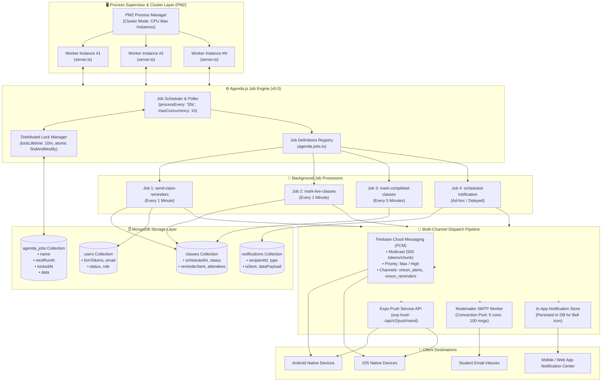
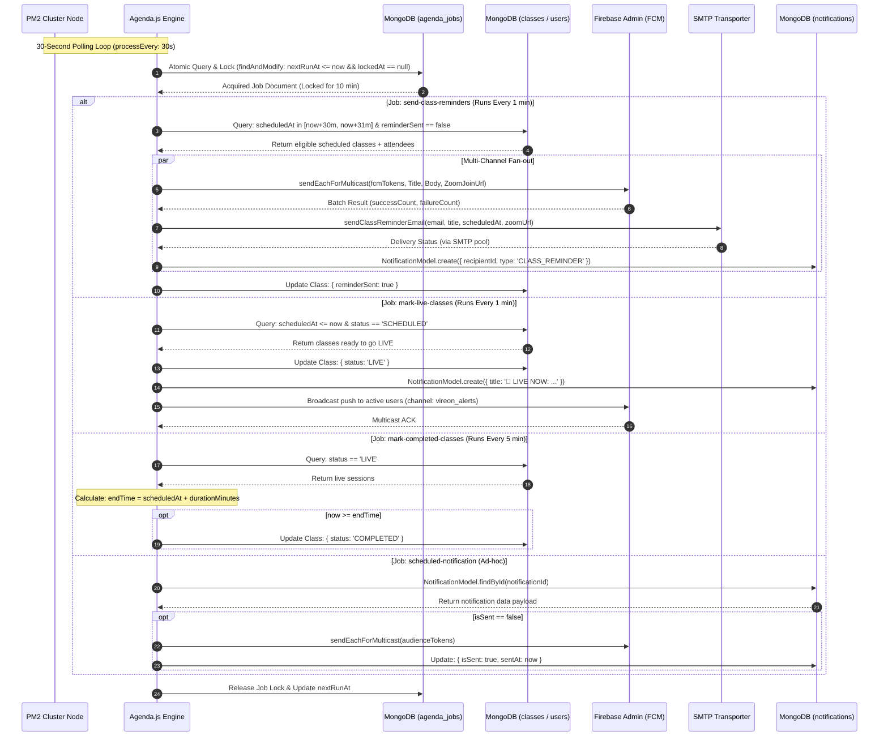
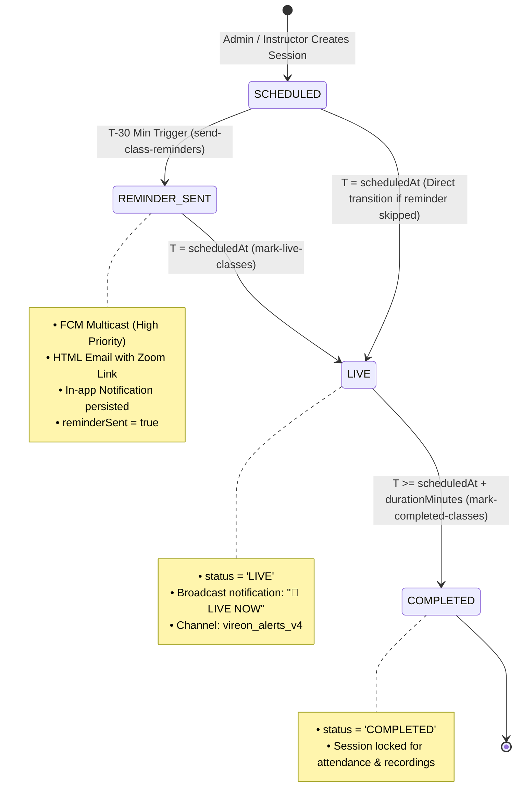
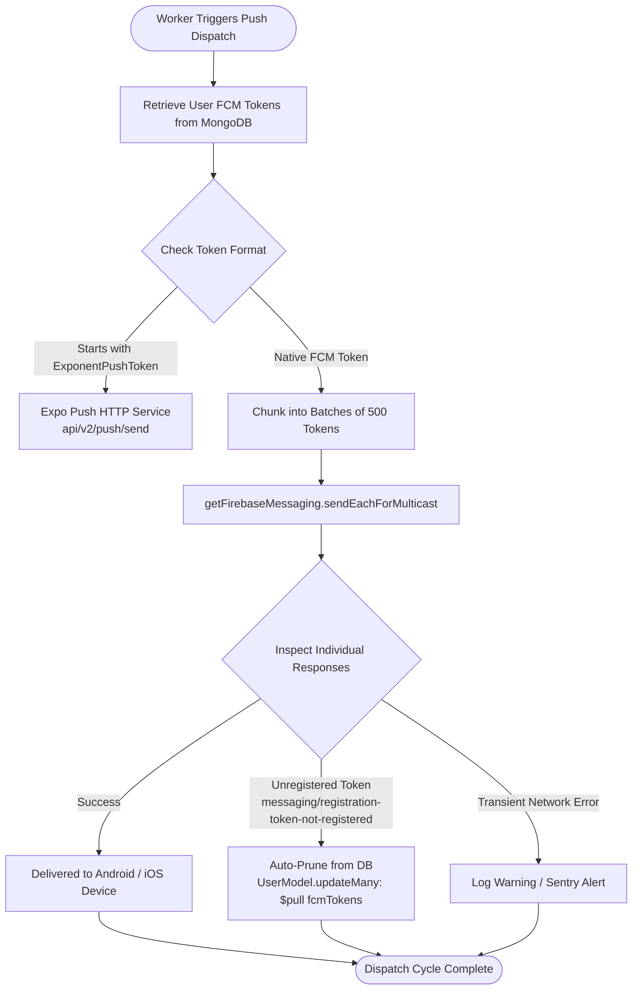

# Vireon Safety Institute — System Architecture & Background Worker Flow

Comprehensive architectural documentation for the **Vireon Safety Institute** background worker, job scheduling, and multi-channel notification engine.

---

## 🏗️ 1. High-Level Worker Architecture Diagram

---

## ⚡ 2. End-to-End Worker Execution & Dispatch Sequence

---

## 🔄 3. Class Lifecycle State Machine

---

## 🧹 4. FCM Token Pipeline & Auto-Pruning Flow

---

## 📋 5. Registered Worker Jobs Reference

| Job Name | Schedule | Target Collection | Primary Action | Side Effects & Outputs |
| :--- | :--- | :--- | :--- | :--- |
| `send-class-reminders` | `every 1 minute` | `classes`, `users` | Detects sessions starting in 30 minutes (`[now+30m, now+31m]`) | Dispatches FCM push, sends transactional reminder email, creates in-app notification, updates `reminderSent: true` |
| `mark-live-classes` | `every 1 minute` | `classes` | Detects scheduled classes where `scheduledAt <= now` | Updates class status to `LIVE`, triggers urgent lock-screen broadcast notification to all active users |
| `mark-completed-classes` | `every 5 minutes` | `classes` | Scans live classes where `now >= scheduledAt + durationMinutes` | Updates status to `COMPLETED`, archives live session state |
| `scheduled-notification` | Ad-hoc / On-demand | `notifications`, `users` | Fetches scheduled broadcast by `notificationId` | Resolves target audience (direct user, role group, or broadcast), dispatches FCM, sets `isSent: true` |

---

## ⚙️ 6. Core Infrastructure & Configuration

### Agenda.js Job Engine (`backend/src/config/agenda.ts`)
- **Collection**: `agenda_jobs`
- **Polling Interval**: `30 seconds` (`processEvery: '30 seconds'`)
- **Concurrency**: `maxConcurrency: 10`, `defaultConcurrency: 5`
- **Lock Lifetime**: `10 minutes` (`defaultLockLifetime: 600000 ms`)
- **Connection Resilience**: Enforced IPv4, 30s connection/selection timeout for DNS and network IP resilience, graceful stop on `SIGTERM` / `SIGINT`.

### PM2 Process Clustering (`backend/ecosystem.config.js`)
- **Execution Mode**: `cluster`
- **Instances**: `max` (Utilizes all available CPU cores)
- **Memory Restart Guard**: Auto-restarts instances exceeding `512MB`
- **Zero-Downtime Reload**: Graceful kill timeout of `5000ms` with rolled cluster restarts.
